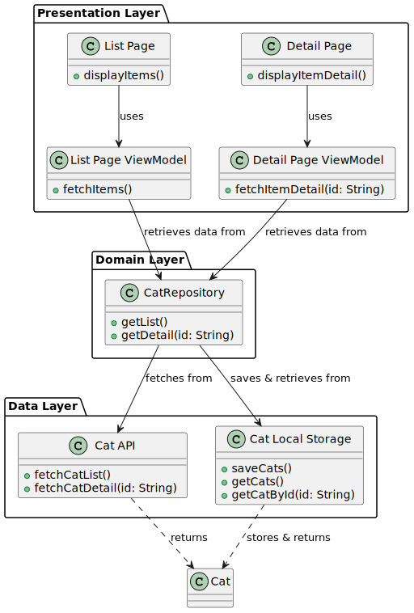

# AllCatPics

Welcome to AllCatPics, the quintessential application for every cat lover out there! 🐱💕 This app is a tribute to the joy
and mystery that our feline friends bring into our lives. Whether you're looking for inspiration, relaxation, or just a
daily dose of cuteness, AllCatPics is your go-to source for everything cat-related.


https://github.com/jatezzz/allcatpics/assets/34223334/ff9fdd0e-e4bb-4a04-8d7d-714c7cd7446f


## Introduction

In the heart of every cat lover is a world filled with purrs, meows, and countless moments of joy. AllCatPics aims to
capture this essence by providing a platform where users can explore, share, and enjoy a vast collection of cat
pictures. From majestic portraits to hilarious cat antics, our app is a curated space dedicated to celebrating cats in
all their glory. 🌟

## Requirements

For developers and contributors looking to dive into the AllCatPics project, here are the primary requirements:

- **Development Environment**: Xcode 15
- **Minimum iOS Version**: iOS 15
- **Language**: Swift 5

We've chosen Xcode 15 and a minimum iOS requirement of iOS 15 to leverage the latest functionalities and ensure broad
compatibility with approximately 90% of current iOS devices (based on recent market research).

## Getting Started

Getting up and running with the AllCatPics project is straightforward. Here's how to get started:

1. **Requirements**: Ensure you have Xcode 15 and Swift 5 installed on your machine.
2. **Clone the Repository**: Clone the AllCatPics repository to your local machine.
3. **Open the Project**: Open the `AllCatPics.xcproject` file in Xcode.
4. **Resolve Dependencies**: Use Xcode's built-in tools to fetch and resolve any third-party dependencies.
5. **Run the Simulator**: Select an iOS simulator and run the project to start exploring AllCatPics immediately.
6. **Physical Device**: For testing on a physical device, ensure your device is connected, and you have the appropriate
   signing configuration set up.

By following these steps, you'll be able to start contributing to AllCatPics or simply enjoy the app on your device.

## Third-Party Libraries

To enhance the AllCatPics experience, we utilize the following libraries:

- **Kingfisher**: For efficient image loading, caching, and automatic retry mechanisms. Kingfisher is an essential
  component in ensuring our cat pictures load swiftly and
  efficiently. [Kingfisher on GitHub](https://github.com/onevcat/Kingfisher)
- **SBTUITestTunnel**: Offers enhanced UI testing capabilities by allowing mocking of JSON responses from the backend.
  This tool is crucial for our testing strategy to ensure the highest quality user
  experience. [SBTUITestTunnel on GitHub](https://github.com/Subito-it/SBTUITestTunnel)
- **SwiftLint**: To ensure high code quality and maintainability, **SwiftLint** has been added as a requirement for the
  project. SwiftLint is a tool that enforces Swift style and conventions, helping to keep the codebase clean and
  consistent. It is a vital addition for any project aimed at achieving professional standards of code quality.
  Developers contributing to the project are required to install SwiftLint and adhere to the rules defined. This step
  ensures that all code contributions follow a common set of style guidelines, reducing the potential for code smells
  and making the code easier to read and maintain. For more information on SwiftLint and how to install and configure
  it, please visit the official GitHub repository: [SwiftLint GitHub](https://github.com/realm/SwiftLint).

## Project Plan and Architecture Overview

### Requirements Given

The project commenced with a specific objective and key pages in mind, detailed as follows:

- **Objective**: Build a simple iOS app using Swift that showcases a List Page and a Detail Page. The app should
  leverage Swift's capabilities to provide a user-friendly experience on iOS devices.

- **Key Pages**:
    - **List Page**: This page is required to display at least ten items from a provided JSON dataset. The display
      should include critical, high-level information about each item to engage users and provide valuable insights at a
      glance.
    - **Detail Page**: Upon selecting an item from the List Page, the app should navigate to a Detail Page. This page
      will fetch and display detailed information about the selected item from an external public API.

### UI Scaffold

Initial definition of List and detail page.


### Base Model Identified

For handling the data effectively, a base model `Cat` was identified and structured as follows:

```swift
struct Cat: Identifiable, Decodable, Hashable {
    let tags: [String]
    let createdAt: String?
    let updatedAt: String?
    let mimetype: String?
    let size: Int?
    let id: String
    let editedAt: String?

    var displayName: String = ""

    enum CodingKeys: String, CodingKey {
        case tags, createdAt, updatedAt, mimetype, size, editedAt
        case id = "_id"
    }
}
```

This model serves as the foundation for both the List Page and Detail Page, ensuring that the app can handle the JSON
data efficiently and display it in a user-friendly manner.

### API Integration

A critical aspect of the project involved identifying and integrating an external public API to fetch detailed data for
the selected item. The selected API offers several endpoints:

* **Fetch with limit**: `https://cataas.com/api/cats?limit=1000`
* **Fetch info**: `https://cataas.com/cat/[:id]?json=true`
* **Fetch image**: `https://cataas.com/cat/[:id]`
* **Fetch Image with Text**: `https://cataas.com/cat/[:id]/says/[:text]`

Documentation for the API is available at `https://cataas.com/doc.html`, providing guidance on how to effectively
leverage the API for fetching data.

**API Integration Strategy**:

* Plan to integrate the API and handle data fetching, including managing error handling and loading states, to ensure a
  seamless user experience.
* Implement efficient data fetching mechanisms to retrieve detailed information for the Detail Page, utilizing
  the `Fetch info` endpoint.
* Explore additional features, such as fetching images with or without text, to enhance the app's functionality and user
  engagement.

This comprehensive approach to API integration aims to ensure that the app not only meets the initial requirements but
also provides a platform for future enhancements and scalability.

### Architecture Finalization

In the final stages of architectural planning, a decision was made to adopt a **Clean Architecture** approach combined
with aspects of **VIPER**, creating a hybrid architecture that leverages the strengths of both methodologies. This
decision was guided by the desire to segregate the app into distinct layers: presentation, domain, data, and model. You
can learn more about Clean Architecture here.

The **presentation layer** utilizes SwiftUI views alongside ViewModels, a choice that significantly enhances testability
and allows for a more modular design. SwiftUI's declarative syntax and data-driven approach make it an ideal fit for
building responsive and state-driven UIs, while the use of ViewModels facilitates a clear separation of concerns, with
business logic neatly encapsulated away from the UI layer.

To manage dependencies effectively, a **Dependency Injection Container** was implemented. This container simplifies the
management of dependencies, ensuring that components are loosely coupled and can be easily replaced or mocked during
testing. This approach enhances the scalability and maintainability of the app.

A custom **Navigation Controller** was developed to manage routing within the app. This controller allows for flexible
navigation between views, supporting complex user flows while maintaining a clear and intuitive interface. It's
particularly important in SwiftUI, where navigation can be managed programmatically to align with the app's
architectural patterns.

Additionally, an innovative **algorithm** was introduced to transform raw IDs from the backend into formats that are
more natural and user-friendly, even when read by assistive technologies like VoiceOver. This consideration ensures that
the app is accessible to a broader audience, including those with visual impairments.

To support the processing needs of the app, various **support views** were crafted. These views are designed to handle
specific tasks or display certain types of content, contributing to a clean and organized codebase.

Below is a visual representation of the initial proposed architecture:



And finally the current one:


This architecture not only adheres to best practices in software development but also caters to the specific needs of
the project. By combining the structured approach of Clean Architecture with the role-specific focus of VIPER, and
embracing SwiftUI for the presentation layer, the project sets a solid foundation for a scalable, maintainable, and
testable iOS app.

## Guidelines for Developers

### Accessibility

Accessibility is a cornerstone of our development process. All contributions should be tested for accessibility,
particularly with VoiceOver, to ensure that AllCatPics is usable by everyone. Please ensure that every UI element is
labeled correctly and that the app can be navigated easily using assistive technologies.

### Test-Driven Development (TDD)

We encourage the use of TDD to ensure reliability and maintainability of code. For an introduction to TDD in Swift,
refer
to [this comprehensive guide](https://www.raywenderlich.com/13585747-test-driven-development-tutorial-for-ios-getting-started).

### Git Flow for Pull Requests

To contribute to AllCatPics, please follow these best practices for pull requests:

- **Branch Naming**: Use descriptive branch names, prefixed with `feature/`, `bugfix/`, or `refactor/`, depending on the
  nature of the contribution.
- **Commit Messages**: Write clear, concise commit messages that describe the changes made and the reason for those
  changes.
- **PR Descriptions**: Provide a detailed description of the changes in the pull request, including the problem solved
  or feature added.
- **Code Reviews**: All PRs must be reviewed by at least one other team member before merging to ensure quality and
  consistency.

## Future Work

We are committed to continuous improvement and have outlined several key areas for future development:

- **Complex Routing in Navigation Controller**: Enhance our navigation controller to support more complex routing
  scenarios, making full use of UI elements as outlined in the Human Interface Guidelines.
- **Filter Items by Tag**: Implement a feature allowing users to filter cat pictures by tags, streamlining the discovery
  process.
- **Random Cat Feature**: Introduce a fun, random cat picture feature to surprise and delight our users with unexpected
  moments of joy.

### CI/CD Implementation Plan

Implementing a CI/CD process will enable us to automate the testing, building, and deployment phases of our app,
ensuring a higher level of code quality and more efficient release cycles. Our CI/CD pipeline will include the following
stages:

1. **Continuous Integration**:
    - **Build Phase**: Compile the code and check for compile-time errors.
    - **Test Phase**: Run unit and UI tests to ensure new changes don't break existing functionality.
2. **Continuous Deployment**:
    - **QA Pipeline**: Deploy the app to a QA environment where the QA team can perform thorough testing.
    - **Release Pipeline**: Once QA approves, the app is automatically deployed to the production environment.

### CI/CD Tools Comparison: GitHub Actions vs. Bitrise

In our research, we compared GitHub Actions and Bitrise based on functionality, ease of use, and pricing.

- **GitHub Actions**:
    - GitHub Actions offers powerful integration within the GitHub ecosystem, allowing for seamless automation of
      workflows directly from the GitHub repository.
    - Pricing is based on the number of minutes used, with different rates for public and private repositories. As of
      our last research, GitHub offers a set number of free minutes for private repositories, with additional minutes
      billed at a rate that varies depending on the GitHub plan.

- **Bitrise**:
    - Bitrise is specifically designed for mobile app CI/CD, providing pre-configured workflows and easy setup for iOS
      projects.
    - Bitrise stands out for its user-friendly interface and the ease with which QA teams can download builds and
      install the app for testing.
    - Pricing for Bitrise is based on build concurrency and the number of build minutes. Bitrise offers several plans,
      from a free tier to enterprise solutions, making it scalable for projects of any size.

### Decision

After careful consideration, we have decided to go with **Bitrise** for our CI/CD needs. The primary factors influencing
our decision were Bitrise's specialization in mobile CI/CD, its ease of use for both developers and QA teams, and its
competitive pricing. Bitrise's platform also offers excellent support for downloading build artifacts directly,
simplifying the process for QA to test new builds. This combination of features, along with a cost-effective pricing
structure, makes Bitrise the ideal choice for AllCatPics' CI/CD process.

### Monitoring

In the pursuit of enhancing our app's reliability and monitoring capabilities, the integration of a robust logging and
crash reporting tool becomes imperative. While the local console has served its initial purpose for development and
debugging, transitioning to a more sophisticated toolset will provide comprehensive insights and analytics, critical for
maintaining and optimizing app performance in a production environment.

**Comparison:**

* **Crashlytics:** A powerful and lightweight tool that offers detailed crash reporting, real-time processing, and
  analytics. It's part of Firebase, providing an integrated suite for analytics, remote configuration, and A/B testing.
  Crashlytics stands out for its seamless integration with the Firebase platform, allowing developers to correlate crash
  data with analytics and utilize remote configurations to adjust app behavior without needing a new deployment.

* **New Relic:** Offers extensive application performance monitoring (APM) features, including real-time analytics,
  crash reporting, and detailed insights into app performance metrics. New Relic is more comprehensive in terms of APM
  capabilities but may require a more complex setup and integration process compared to Crashlytics. Pricing for New
  Relic varies based on data usage and features required, potentially making it a costlier option for small to
  medium-sized projects.

**Decision:**

After careful consideration of both options' features, ease of integration, and cost implications, **Crashlytics** has
been chosen for the project. Its free tier offers substantial value for crash reporting and analytics, making it an
attractive choice for startups and independent developers. Moreover, Crashlytics' ability to integrate with Firebase's
remote configuration and analytics tools adds significant value, enabling a more dynamic and responsive app management
strategy.

Integrating Crashlytics will not only improve our ability to track and resolve issues more efficiently but also enhance
our understanding of user interactions and app performance, paving the way for data-driven decisions and updates. This
move is aligned with our future development goals of ensuring the highest quality user experience and app reliability.

For more information on Crashlytics and its integration into iOS projects, please refer to the official documentation:
Firebase Crashlytics.

This step towards professional logging and monitoring underscores our commitment to delivering a robust, reliable app
and is a critical component of our future development strategy.
## Acknowledgements

A huge thank you to everyone who has contributed to making AllCatPics a reality. Your creativity, dedication, and
passion for cats have made this project a joy to work on. 🎉

## License

AllCatPics is available under the Apache License, Version 2.0. See the LICENSE file in their repository for more info.


---

Thank you for your interest in AllCatPics. Let's make the world a happier place, one cat picture at a time! 🐾
